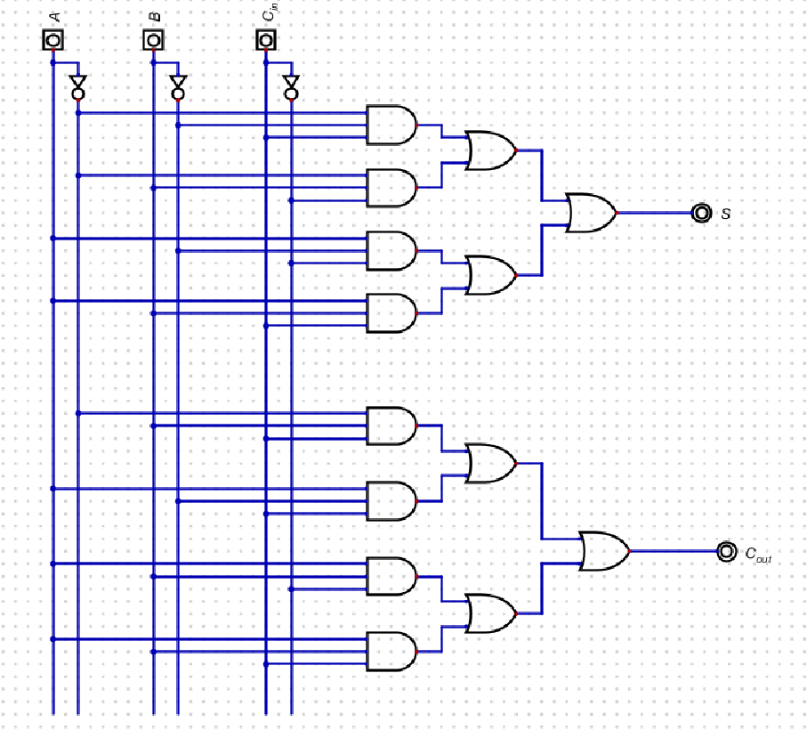
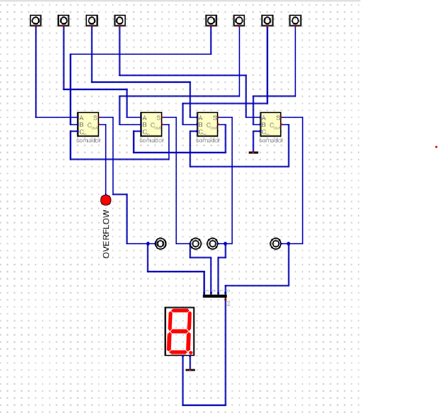

# Somador 4 bits

- Ana Beatriz Passos Beggiato
- T12G01 
- R.A.: A2024.1A.0101

## Somador unitário desenvolvido:

Disponível em: <code>./somador.dig</code>

## Circuito completo desenvolvido

Disponível em: <code>./somador4bits.dig</code>

## Vídeo de funcionamento do circuito:

<iframe width="560" height="315" src="https://www.youtube.com/embed/sD8mZl1BMcI?si=7QCtFBtfmUFpwyl7" title="YouTube video player" frameborder="0" allow="accelerometer; autoplay; clipboard-write; encrypted-media; gyroscope; picture-in-picture; web-share" referrerpolicy="strict-origin-when-cross-origin" allowfullscreen></iframe>

- A explicação fica pro ao vivo :)